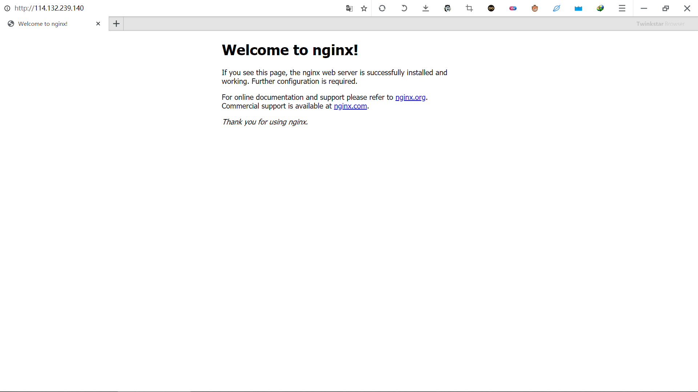
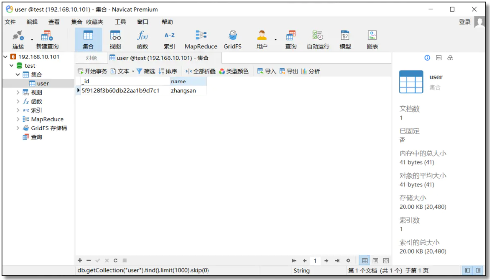
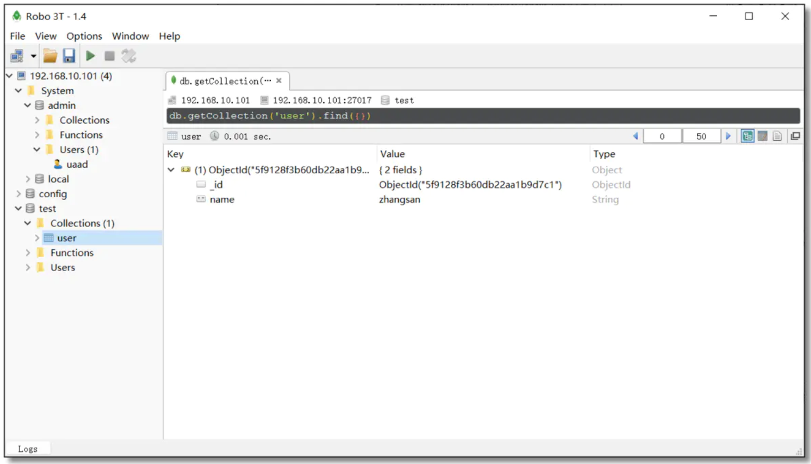
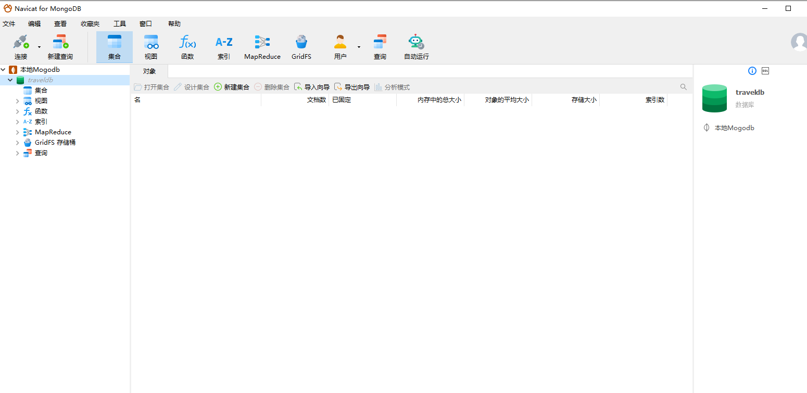
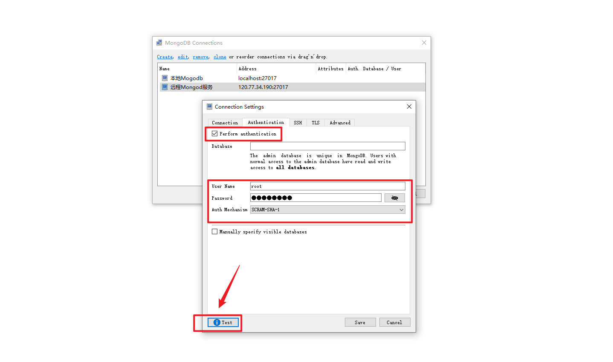
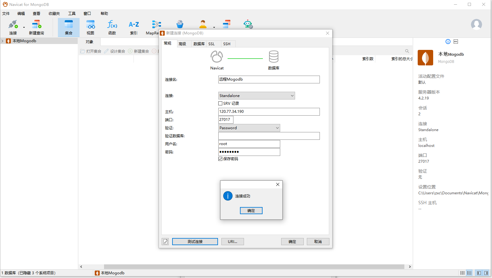

## JDK安装

### 01、上传jdk1.8的tar包到/www/jdk/jdk-8u281-linux-x64.tar.gz 

### 02、解压 jdk-8u281-linux-x64.tar.gz 

```sh
tar -zxvf jdk-8u281-linux-x64.tar.gz 
```

### 03、选择这个jdk安装目录

```sh
cd /www/kuangstudy/jdk/jdk1.8.0_281
```

### 04、配置jdk的环境变量

```SH
vim /etc/profile
```

### 05、在文件的末尾追求jdk的环境变量的配置如下：

```sh
export JAVA_HOME=你的jdk的目录
export PATH=$JAVA_HOME/bin:$PATH
#export CLASSPATH=.;$JAVA_HOME/lib/dt.jar:$JAVA_HOME/lib/tools
```

### 06、保存退出：:wq

### 07、重启配置文件

```sh
source /etc/profile
```

​		输入java -version

```sh
[root@iZuf62zev3la2ivndnxra5Z jdk1.8.0_281]# java -version
java version "1.8.0_281"
Java(TM) SE Runtime Environment (build 1.8.0_281-b09)
Java HotSpot(TM) 64-Bit Server VM (build 25.281-b09, mixed mode)
```


## nginx安装

### 01、创建nginx服务器目录

```sh
mkdir -p /www/nginx
cd /www/nginx
```

### 02、下载安装

```sh
wget http://nginx.org/download/nginx-1.20.1.tar.gz
```

### 03、安装编译工具及库文件

```sh
yum -y install make zlib zlib-devel gcc-c++ libtool  openssl openssl-devel
```

### 04、解压nginx

```sh
tar -zxvf nginx-1.20.1.tar.gz
```

### 05、创建nginx的临时目录

```sh
mkdir -p /var/temp/nginx
```

### 06、进入安装包目录

```sh
cd nginx-1.20.1
```

### 07、编译安装

​		需要手动一条一条输入，否则报错。

```sh
./configure \
--prefix=/usr/local/nginx \
--pid-path=/var/run/nginx.pid \
--lock-path=/var/lock/nginx.lock \
--error-log-path=/var/log/nginx/error.log \
--http-log-path=/var/log/nginx/access.log \
--with-http_gzip_static_module \
--http-client-body-temp-path=/var/temp/nginx/client \
--http-proxy-temp-path=/var/temp/nginx/proxy \
--http-fastcgi-temp-path=/var/temp/nginx/fastgi \
--http-uwsgi-temp-path=/var/temp/nginx/uwsgi \
--http-scgi-temp-path=/var/temp/nginx/scgi \
--with-http_stub_status_module \
--with-http_ssl_module \
--with-http_stub_status_module 
```

安装以后的目录信息

```sh
nginx path prefix: "/usr/local/nginx"  nginx binary file: "/usr/local/nginx/sbin/nginx"  nginx modules path: "/usr/local/nginx/modules"  nginx configuration prefix: "/usr/local/nginx/conf"  nginx configuration file: "/usr/local/nginx/conf/nginx.conf"  nginx pid file: "/var/run/nginx.pid"  nginx error log file: "/var/log/nginx/error.log"  nginx http access log file: "/var/log/nginx/access.log"  nginx http client request body temporary files: "/var/temp/nginx/client"  nginx http proxy temporary files: "/var/temp/nginx/proxy"  nginx http fastcgi temporary files: "/var/temp/nginx/fastgi"  nginx http uwsgi temporary files: "/var/temp/nginx/uwsgi"  nginx http scgi temporary files: "/var/temp/nginx/scgi"
```

|              命令              |                 解释                 |
| :----------------------------: | :----------------------------------: |
|            --prefix            |          指定nginx安装目录           |
|           --pid-path           |            指向nginx的pid            |
|          --lock-path           | 锁定安装文件，防止被恶意篡改或误操作 |
|        --error-log-path        |               错误日志               |
|        --http-log-path         |               http日志               |
| --with-http_gzip_static_module | 启用gzip模块，在线实时压缩输出数据流 |
|  --http-client-body-temp-path  |      设定客户都拿请求的临时目录      |
|     --http-proxy-temp-path     |          设定http代理的目录          |
|    --http-fastcgi-temp-path    |        设定fastcgi代理的目录         |
|     --http-uwsgi-temp-path     |         设定uwsgi代理的目录          |
|     --http-scgi-temp-path      |          设定scgi代理的目录          |

### 08、 make编译

```sh
make
```

### 09、 安装

```shell
make install
```

### 10、 进入sbin目录启动nginx

```shell
cd /usr/local/nginx/sbin
```

​		执行nginx启动

```sh
./nginx 
```

```sh
#停止：
./nginx -s stop
#重新加载：
./nginx -s reload 
#文件是否正确：
./nginx -t
```

### 11、打开浏览器，访问虚拟机所处内网ip即可打开nginx默认页面，显示如下便表示安装成功：

```sh
http://ip
```



### 12、注意事项

1. 如果在云服务器安装，需要开启默认的nginx端口：80
2. 如果在虚拟机安装，需要关闭防火墙
3. 本地win或mac需要关闭防火墙
4. nginx的安装目录是：/usr/local/nginx/sbin

### 13、配置nginx的环境变量

```sh
vim /etc/profile
```

​		在文件的尾部追加如下：

```sh
export NGINX_HOME=/usr/local/nginx
export PATH=$NGINX_HOME/sbin:$PATH
```

​		重启配置文件

```sh
source /etc/profile
```

## Redis安装

​		官网：http://www.redis.cn/

​		下载、解压、编译Redis

### 1、创建一个目录

​		如果安装报错，请把系统文件的组件依赖，更新到最新

```sh
yum -y install gcc gcc-c++ make tcl
yum -y install centos-release-scl
yum -y install devtoolset-9-gcc devtoolset-9-gcc-c++ devtoolset-9-binutils
scl enable devtoolset-9 bash
```

​		然后 执行安装

```sh
mkdir -p /www/redis
cd /www/redis
wget http://download.redis.io/releases/redis-6.0.6.tar.gz
tar xzf redis-6.0.6.tar.gz
cd redis-6.0.6
make
```

### 2、进入到解压后的 `src` 目录，通过如下命令启动Redis:

```sh
src/redis-server
```

### 3、您可以使用内置的客户端与Redis进行交互:

```sh
$ src/redis-cli
redis> set foo bar
OK
redis> get foo
"bar"
```

### 4、修改配置，设置密码，远程连接

​		打开配置文件redis.conf

```
cd /www/kuangstudy/redis/redis-6.0.6
vim redis.conf
```

- redis默认启动方式，占用的方式启动，需要修改

  ```sh
  daemonize yes
  ```

- 不安全，需要设置密码

  ```sh
  requirepass mkxiaoer1986.
  ```

- 远程启动：bind注释掉

  ```sh
  protected-mode no
  #bind 127.0.0.1
  ```

   退出保存：:wq

#### 启动redis服务，

​		==这个时候，你的启动必须一定要跟配置文件才可以生效。==

```sh
[root@iZuf62zev3la2ivndnxra5Z redis-6.0.6]# src/redis-server ./redis.conf 
```

```sh
[root@iZuf62zev3la2ivndnxra5Z redis-6.0.6]# src/redis-server /www/kuangstudy/redis/redis-6.0.6/redis.conf 
```

​		==新手建议，如果你怕改坏文件，可以考虑把redis.conf文件，复制到外部来进行编辑，然后指定即可。==

```
23985:C 02 Nov 2021 23:28:05.229 # oO0OoO0OoO0Oo Redis is starting oO0OoO0OoO0Oo
23985:C 02 Nov 2021 23:28:05.229 # Redis version=6.0.6, bits=64, commit=00000000, modified=0, pid=23985, just started
23985:C 02 Nov 2021 23:28:05.229 # Configuration loaded

```

​		进程查看是否启动

```
[root@iZuf62zev3la2ivndnxra5Z redis-6.0.6]# ps -ef | grep redis
root     10287  9198  0 23:21 pts/2    00:00:00 src/redis-cli
root     23986     1  0 23:28 ?        00:00:00 src/redis-server *:6379
root     24370  3961  0 23:28 pts/0    00:00:00 grep --color=auto redis

```

​		用客户端查看

```sh
[root@iZuf62zev3la2ivndnxra5Z redis-6.0.6]# src/redis-cli
127.0.0.1:6379> ping
(error) NOAUTH Authentication required.  
127.0.0.1:6379> auth mkxiaoer1986.
```

#### 5、远程连接redis

```sh
protected-mode no
#bind 127.0.0.1
```

- 上面必须在配置文件中修改
- 然后如果你是云服务器，请到对应【安全组】去开放6379的端口。你的java代码才可以连接你的redis服务。

### 6、配置环境变量

​		上面的问题：我每次启动服务，连接客户端，都需要找到redis的解压目录src才能去执行。我能不能像JDK一样，在任意目录都可以执行redis相关的服务呢，答案可以：就是把redis配置成环境变量即可

```sh
vim /etc/profile
```

​		增加如下

```sh
export REDIS_HOME=/www/redis/redis-6.0.6
export JAVA_HOME=/www/jdk/jdk1.8.0_281
export PATH=$REDIS_HOME/src:$JAVA_HOME/bin:$PATH
```

​		重启配置文件

```sh
source /etc/profile
```

​		测试执行

```sh
在任意目录执行
> redis-server /xxx/redis.conf
> redis-cli
```

## MongDB安装

### 01、上传Mongodb文件到云服务器

```
wget https://downloads.mongodb.com/linux/mongodb-linux-x86_64-enterprise-rhel70-4.2.19.tgz
```

```sh
/www/mongodb-linux-x86_64-enterprise-rhel70-4.2.19.tgz
```

### 01、开始解压

```sh
 tar -zxvf mongodb-linux-x86_64-enterprise-rhel70-4.2.19.tgz 
```

### 02、移动到用户目录下

```sh
 mv mongodb-linux-x86_64-enterprise-rhel70-4.2.19 /usr/local/mongodb
 cd /usr/local/mongodb
```

### 03、配置环境变量，方便进行控制

```sh
vim /etc/profile
export MONGODB_HOME=/usr/local/mongodb
export PATH=$MONGODB_HOME/bin:$PATH
```

### 04、重启配置文件即可

```sh
source /etc/profile
```

### 05、查询安装

```sh
[root@iZwz9ioyb48q95yeh6o7njZ mongodb]# mongo -version
MongoDB shell version v4.2.19
```

### 06、创建数据和日志目录

```sh
[root@iZwz9ioyb48q95yeh6o7njZ mongodb]# mkdir data/db -p
[root@iZwz9ioyb48q95yeh6o7njZ mongodb]# mkdir data/logs -p
[root@iZwz9ioyb48q95yeh6o7njZ mongodb]# cd data/logs/
[root@iZwz9ioyb48q95yeh6o7njZ logs]# touch mongodb.log
```

### 07、在mongodb根目录下创建mongodb.conf文件如下

```properties
# 端口号
port=27017
#数据库存储的文件位置
dbpath=/usr/local/mongodb/data/db
# 日志文件位置
logpath=/usr/local/mongodb/data/logs/mongodb.log
# 以追加日志形式记录
logappend=true
# 过滤掉无用日志信息，若需要调试设置false
quiet=true
# 以后台方式运行
fork=true
# 最大同时连接数
maxConns=100
#不启动验证权限
noauth=true
#启动用户账号权限
# auth=true
#开启日志，默认true
journal=true
# 提供外网访问
bind_ip=0.0.0.0

```

### 08、启动mongodb

```sh
 mongod -f mongodb.conf 
```

```
[root@iZwz9ioyb48q95yeh6o7njZ mongodb]# mongod -f mongodb.conf 
mongod: error while loading shared libraries: libnetsnmpmibs.so.31: cannot open shared object file: No such file or directory
```

​		如果启动报错安装一个组件即可

```
yum install net-snmp
```

​		然后在启动

```
mongod -f mongodb.conf 
```

​		安装和启动成功如下


​		记得阿里云安全组开放27017的端口哦

### 08、windows安装Mongodb的可视化工具

#### Navicat for MongoDB

​		官网下载地址：[http://www.navicat.com.cn/download/navicat-for-mongodb](https://links.jianshu.com/go?to=http%3A%2F%2Fwww.navicat.com.cn%2Fdownload%2Fnavicat-for-mongodb)

​		老牌的数据库管理工具，支持多种数据库的集成，已集成 MongoDB 类型，属于付费型管理工具。好处是用会了一个 DB 版的 Navicat，所有 DB 版都会很顺手，维持一套操作习惯，如果再肌肉记忆一些快捷键，会更加高效。



#### Robo 3T (Robomong) 推荐

​		官网下载地址：[https://robomongo.org/download](https://links.jianshu.com/go?to=https%3A%2F%2Frobomongo.org%2Fdownload)

​		Robo 3T 前身是 Robomongo，后被 3T 公司收购，是一款免费开源的 GUI 管理工具。支持 MongoDB 4.0+，轻量级 GUI，支持语法填充等等。适用于 Windows，macOS 和 Linux 系统。



​		创建一个数据库



​		基本操作

​		1：进入mongodb命令行

```sh
> mongo
```

​		2：选中数据集合

```sh
>use admin
```

​		3：创建用户和密码

```sh
>db.createUser({user:"root",pwd:"mkxiaoer",roles:["root"]})
```

​		4：验证

```sh
>db.auth("root","mkxiaoer")
```

​		5：查看所有的用户

```sh
>show users
```

​		6：测试是否链接






