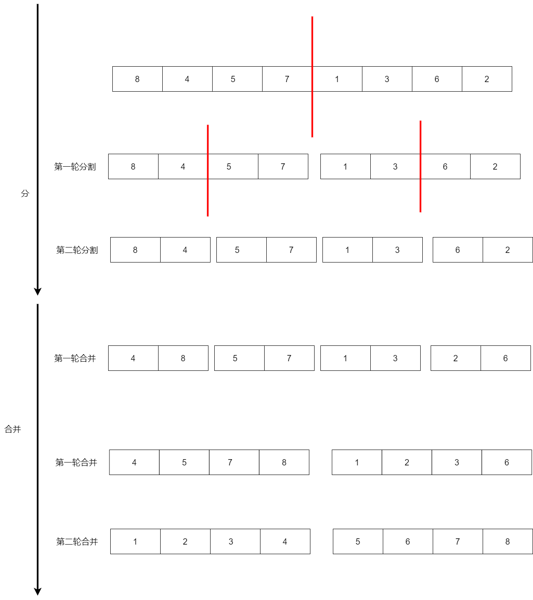

### 数据结构之排序

#### 归并排序

归并排序是一种分而治之的思想。

例如一个数组

```java
int[] arr = {8,4,5,7,1,3,6,2};
```



通过不断二分，使得最小的数组长度为二，之后使用一个临时数组进行合并操作。

具体代码为：

```java
private static void merge(int[] arr, int left, int mid, int right, int[] temp) {
    int LEFT_END = mid+1;
    int RIGHT_END = right+1;
    int i = left;
    int j = LEFT_END;
    int t = left;
    //合并操作
    while(i<LEFT_END && j<RIGHT_END) {
        if(arr[i] < arr[j]) {
            temp[t] = arr[i];
            i++;
        }else {
            temp[t] = arr[j];
            j++;
        }
        t++;
    }

    //若存在未满
    while(i < LEFT_END) {
        temp[t++] = arr[i++];
    }
    //若存在未满
    while(j < RIGHT_END) {
        temp[t++] = arr[j++];
    }
	//重新赋值给arr
    for(int index = left ; index < RIGHT_END ; index++) {
        arr[index] = temp[index];
    }
}

public static int[] mergeSort(int[] arr, int left, int right, int[] temp) {
    if(left < right) {
        int mid = left+(right-left)/2;
        //左划分
        mergeSort(arr, left, mid, temp);
        //右划分
        mergeSort(arr, mid+1, right, temp);
        //合并
        merge(arr, left, mid, right, temp);
    }
    return arr;
}
```

