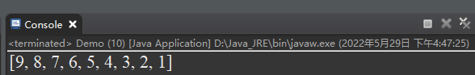
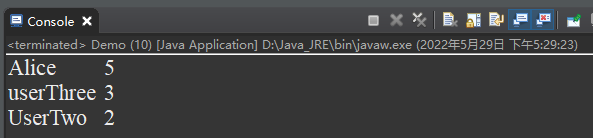

### 数组排序

#### 一维数组排序

对于排序，Java内置了工具类==Arrays.sort==,其内部原理使用的是快速排序算法，排序之后的结果为升序。

- 例如

  对于int类型数组

  ```java
  int[] arr = {9,7,8,2,4,3,6,1,5};
  ```

  可以使用Arrays.sort进行排序

  ```java
  Arrays.sort(arr);
  ```

  无需返回值，因为对arr本身进行操作。操作之后返回的结果为

  ```java
  arr=[1,2,3,4,5,6,7,8,9];
  ```

  同理，对于String类型数组也是同样的。

  ```java
  String[] strs = {"b","d","c","a"};
  Arrays.sort(strs);
  ```

  排序之后的结果按照字典序升序进行排列

  ```java
  strs = ["a","b","c","d"];
  ```

那么问题来了，如果我想要的效果是大的排在前面——降序呢？该如何操作呢？

这就涉及到了内部类与重写的操作了。

#### 自定义排序

通过观察java的api文档，对Arrays中的sort方法中，有一个参数==Comparator==

```java
`**sort**(T[] a,  Comparator<? super T> c)`
```

可以通过内部类，自定义比较规则。

- 例如，对String类型的一维数组降序

  ```java
String[] strs = {"b","d","c","a"};
  Arrays.sort(strs, new Comparator<String>(){
      @Override
      public int compare(String o1, String o2){
          //字符串的比较使用String中的compareTo方法
          //compareTo比较之后，结果返回1，表示大于，返回-1，表示小于。
          return o2.compareTo(o1);
      }
  });
  ```
  
  那么，对于int类型数组是不是一样的操作呢？

  ```java
int[] arr = {9,7,8,2,4,3,6,1,5};
  Arrays.sort(arr, new Comparator<int>(){
      @Override
      public int compare(int o1, int o2){
          return o2-o1;
      }
  });
  ```
  
  然而却得到一个==编译时异常==

  

  这是为什么呢？

  通过比较两代码发现，==int==属于基本数据类型，而String属于引用类型，故而将int转换为Integer

  ```java
Integer[] arr = {9,7,8,2,4,3,6,1,5};
  Arrays.sort(arr, new Comparator<Integer>(){
      @Override
      public int parse(int o1, Integer o2){
          return o2-o1;
      }
  });
  ```
  
  

  完美运行~


#### 二维数组排序

上面进行了一维数组的int类型和String类型的排序，那么对于二维数组呢，这又该怎么办呢？

- 例如，leetcode第79场双周赛的第二题

  经过处理后的到数组

  ```java 
  String[][] sendAndWords = {{"Alice","5"},
                             {"UserTwo","2"},
                             {"userThree","3"}};
  //其中sendAndWords第一列表示的是用户，第二列表示发送的单词数。
  /**需求为
    1、输出单词数最多的用户。
    2、若单词数相同，则按名字字典序最大的输出。
  */
  ```

  那么我们对这个二维数组的操作为先对第二列降序，在第二列相同的情况下对第一列降序。

  利用上面一维数组的思想

  ```java
  String[][] sendAndWords = {{"Alice","5"},
                             {"UserTwo","2"},
                             {"userThree","3"}};
  Arrays.sort(sendAndWords, new Comparator<String[]>() {
      @Override
      public int compare(String[] o1, String[] o2) {
          // 若单词数相同，那么按照用户名字典序降序
          if (o2[1].equals(o1[1])) {
              return o2[0].compareTo(o1[0]);
          }
          // 按单词数降序。
          return o2[1].compareTo(o1[1]);
      }
  });
  ```

  完美运行~

  

  