#### 部署hexo（部署到git仓库）

##### 环境配置：git，nodejs

###### git（Windows版本）

1. 登录==git==官网 <https://git-scm.com/> 点击==downloads==下载

   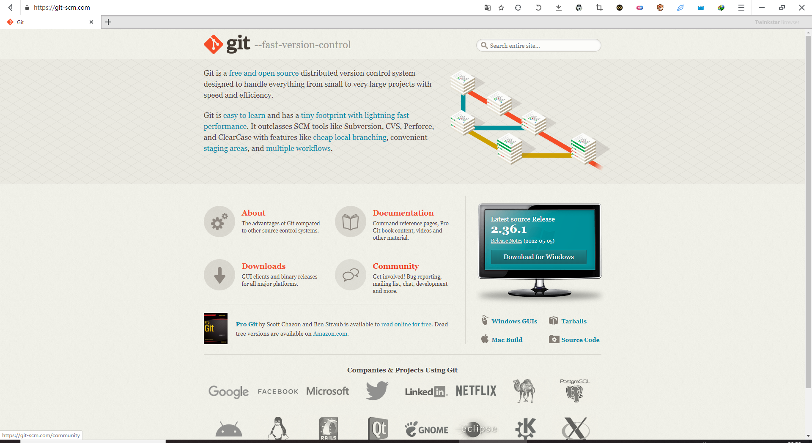

   <!--more-->

2. 点击==Windows==

   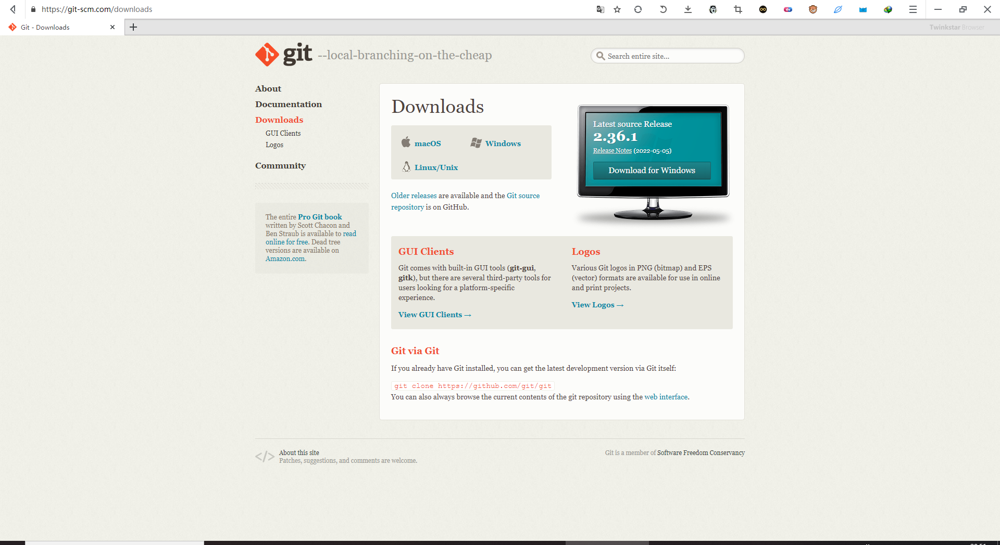

3. 按电脑位数选择版本

   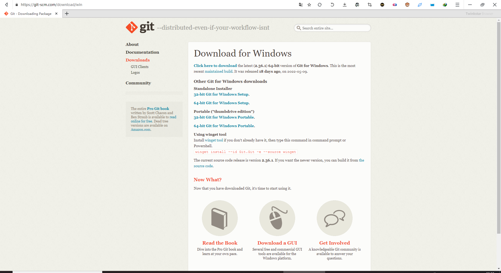

4. 打开cmd（管理员身份运行）命令行

   ```cmd
   #查看安装版本，以此校验git安装是否成功
   git --version
   ```

   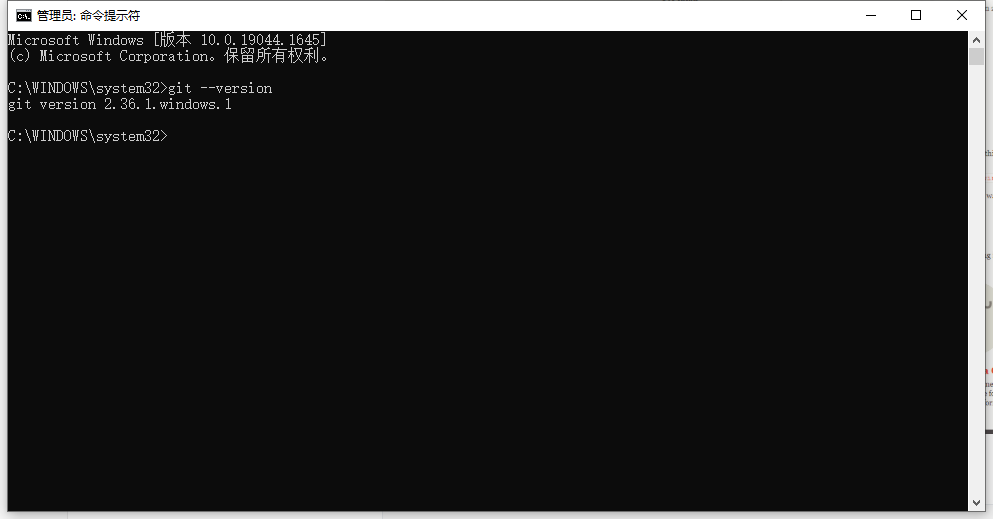

###### nodejs（Windows版本）

1. 前往官网下载==nodejs== <https://nodejs.org/zh-cn/download/>

   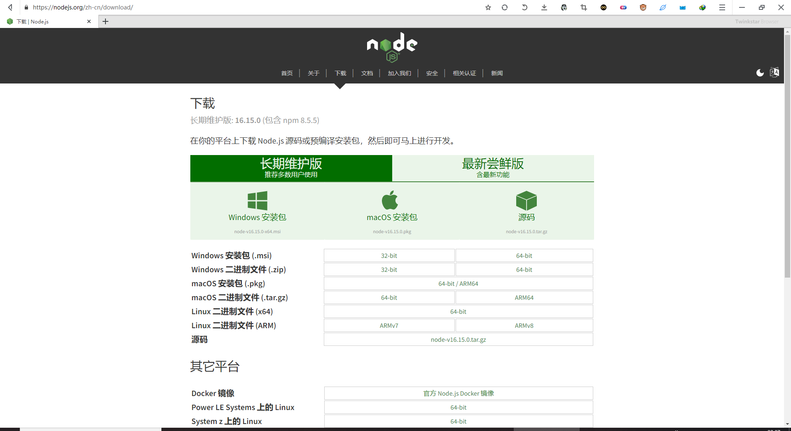

2. 下载完成后点击安装

   安装nodejs，直接点下一步，直至安装完成。

3. 检验安装是否成功

   ```cmd
   #查看nodejs版本，检验安装是否成功
   node -v
   ```

   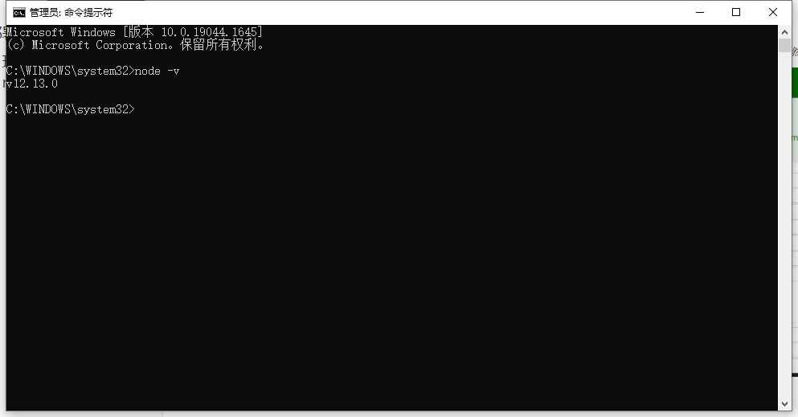

##### 安装hexo

所有必备的应用程序安装完成后，即可使用 npm 安装 Hexo。

```cmd
npm install -g hexo-cli
```

##### 建站

安装 Hexo 完成后，请执行下列命令，Hexo 将会在指定文件夹中新建所需要的文件。

```cmd
hexo init <folder> #将hexo初始化在folder文件夹中
cd <folder>
npm install
```

##### 测试运行

在cmd中运行

```cmd
hexo s #一定要在hexo的根目录中，及folder文件夹中
```

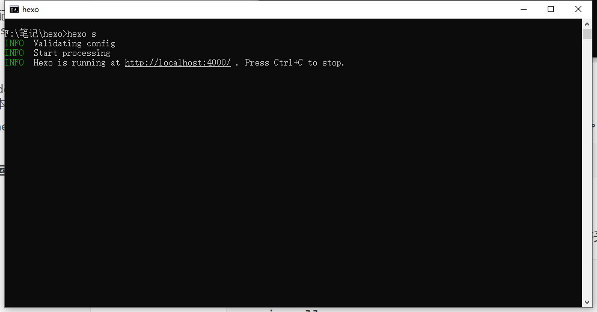

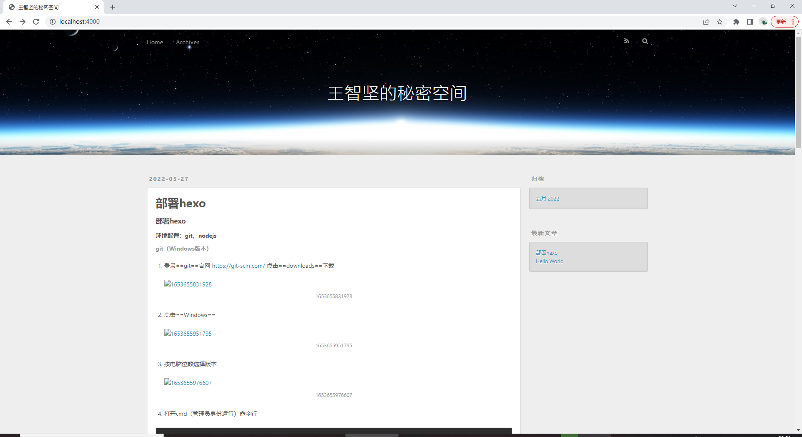

#### 主题更换（yilia）

1. 根目录下打开==git bash==

2. 输入

   ```cmd
   git clone https://github.com/litten/hexo-theme-yilia.git themes/yilia
   ```

3. 修改根目录下的==_config.yml==配置

   将==theme==的值修改为==yilia==

4. 三连（hexo clean,g,d）查看效果

   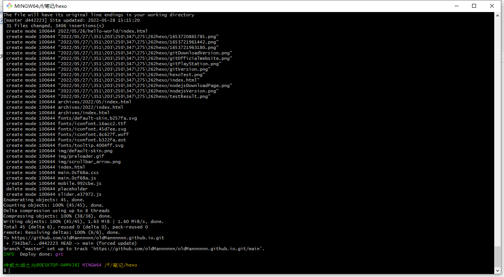

5. 头像设置

   打开==yilia==下的==_config.yml==，修改==avatar==(头像)和==favicon==(选项卡图标)

   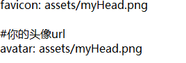

   此时的路径为相对路径，绝对路径为hexo根目录下的source中。故在source文件夹中放入文件

   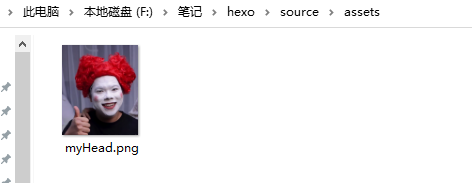

   三连查看效果

   

   

#### 部署遇到的问题

##### hexo d失败

- swapd文件错误

  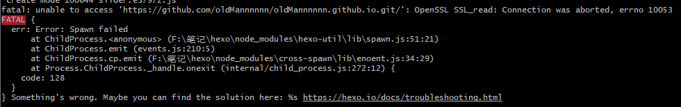

  解决办法：

  1. 进入hexo的根目录

  2. 删除==.deploy_git==文件

  3. 在根目录右键打开==git bash==

  4. 重新部署

     ```cmd
     hexo clean
     hexo g
     hexo d
     ```

- 网络不稳定

  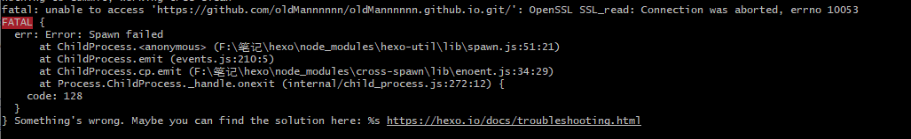

  多尝试几次即可。

##### md中图片不显示

1. 进入hexo的根目录

2. 修改==_config.yml==的配置，找到==post_asset_folder==，其默认为==false==，将其修改为==true==。

   （此后，通过==hexo new==一个新的文件时，会在文件的同级目录下生成一个同名的文件夹，hexo生成页面时，将其一起打包进一个文件夹中。故接下来要修改md的图片位置）

3. 打开Typora，点击==文件==->==偏好设置==->==图片插入==，修改为下图所示。

   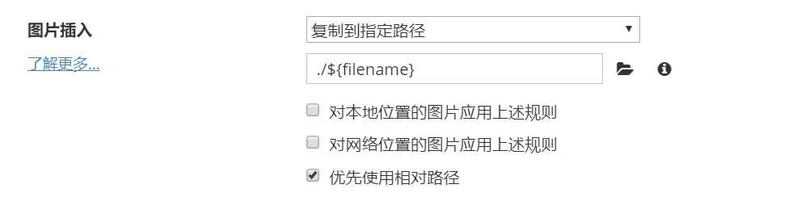

4. 此时再次三连(hexo clean, hexo g, hexo d)即可。

#### 部署hexo（部署到云服务器）

​		参考地址<https://www.jianshu.com/p/a8aedaea642b>