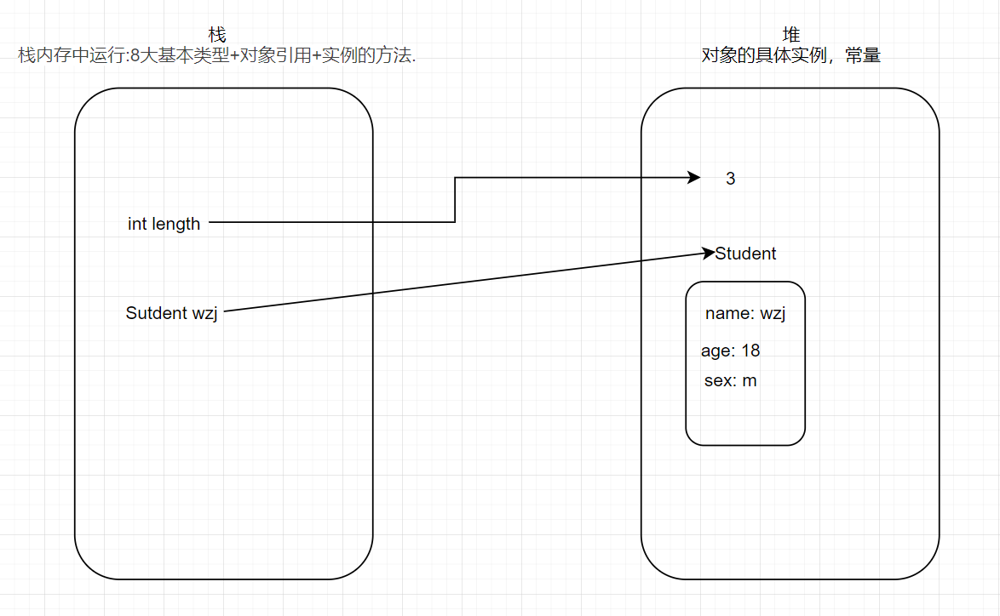
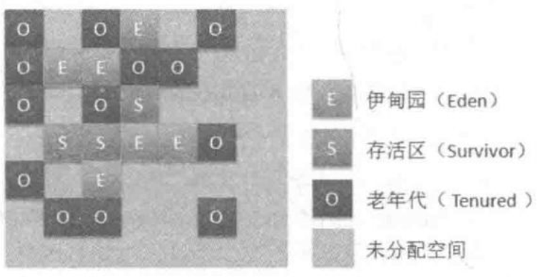
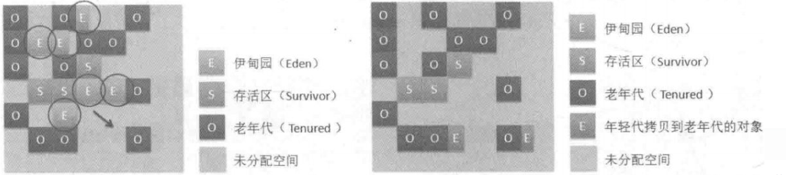
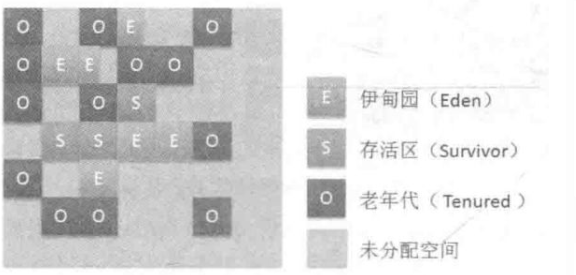
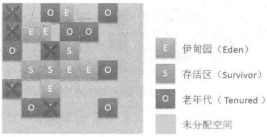
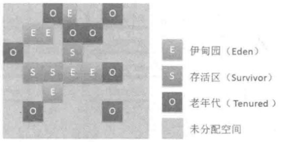
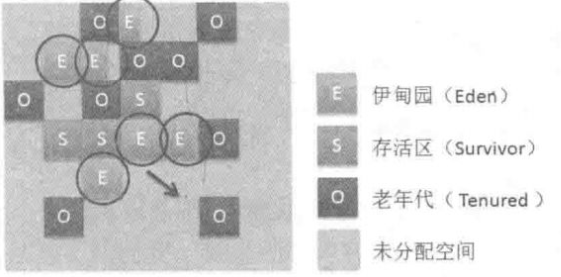
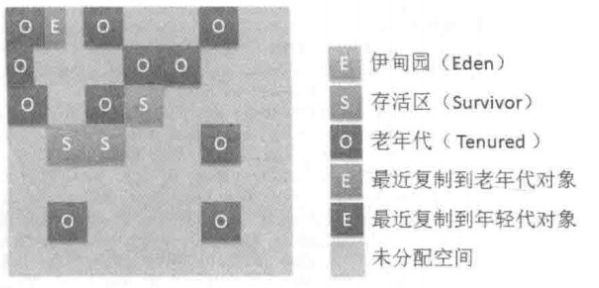
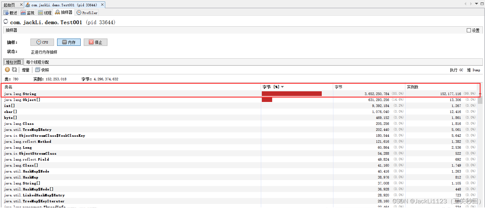
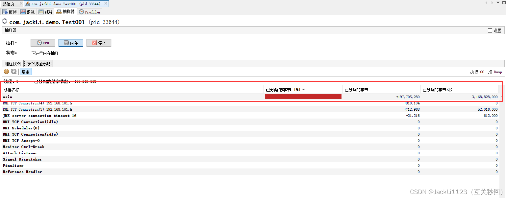

### Java八股文笔记（一）

#### 一、Final原理

##### 作用在变量上

- 基本类型变量

  当一个final修饰基本类型变量时，变量需立即初始化，且之后不允许修改变量的值。所以一般用final修饰基本类型变量时都是常量，那么变量名全为大写。

  ```java
  final int STUDENT_AGE = 10;
  final char STUDENT_SEX = 'm';
  ```

- 引用类型

  当一个final修饰引用类型变量时，由于引用类型指向的是地址值，故对于当前变量的地址值之后无法修改，而地址值指向的内容是可以修改的。

  ```java
  private final Student wzj = new Student("wzj", 18, m);
  private final int length = 3;
  ```

  如下图所示

  

  基本类型指向了常量的地址值，而引用类型指向的同样是地址值，但地址值中的东西可以修改。

##### 作用在方法上

作用在方法上时，若有子类继承此类，那么子类无法对该方法进行重载。一旦final修饰方法，那么在编译的时候已经静态绑定了，所以final方法比非final方法块。

##### 作用在类上

作用在类上时，表示该类无法被继承，那么final就不能修饰抽象类，这与抽象类的思想完全相反。若一个类修饰为final类，那么里面的方法默认为final方法。

##### final域的重排序

###### 先写入final变量，后调用该对象

在构造函数对一个final对象的写入，与该构造函数被一个引用对象与引用，这之间不能重排序。

###### 先读对象的引用，在读final变量

读一个包含final域的对象，与读这个final变量，这之间不能重排序。

#### 二、CMS与G1 的区别

##### CMS垃圾收集

###### 说明

- CMS是老年代并发GC算法：(ConcurrentMark-SweepGC、CMS GC)。
- 算法总体逻辑：标记-清除（Mark-Sweep)

###### 流程

总体流程为：初始标记=> 并发标记=> 重新标记=> 并发清理。

详细流程如下：

1. 初始标记（Initial Mark)（

   STW 

   ）

   1. 此阶段会暂停虚拟机（**STW**)，由根对象扫描出所有的关联对象，并做出标记。此过程只会导致JVM短暂暂停。

2. 并发标记（Concurrent Marking)

   1. 恢复所有暂停的线程对象，并且对之前标记过的对象进行扫描，取得所有跟标记对象有关联的对象。

3. 并发预清理（Concurrent Precleaning)

   1. 査找所有在并发标记阶段新进入老年代的对象(例如一些对象可能从新生代晋升到老年代，或者有一些对象被分配到老年代）通过重新扫描，减少下一阶段的工作。

4. 重新标记（Remark)（

   STW 

   ）

   1. 此阶段会暂停虚拟机（**STW**），对在并发标记阶段被改变的引用或新创建的对象进行标记。

5. 并发清理（Concurrent Sweeping)

   1. 恢复所有暂停的应用线程，对所有未标记的垃圾对象进行清理，并且尽量将己回收对象的空间重新拼凑为一个整体。在此阶段收集器线程和应用程序线程并发执行。

6. 并发重置（Concurrent Reset)

   1. 重置CMS收集器的数据结构，等待下一次垃圾回收。

###### 优点

1. 支持并发收集。
2. 低停顿。
   1. 垃圾收集过程中最耗时的并发标记和并发清除过程，CMS可以在这两个过程中和用户线程一起工作。所以，用户线程在这个时候就不用停下来了。

###### 缺点

1. 对CPU非常敏感。
   1. 在并发阶段虽然不会导致用户线程停顿，但是会占用了一部分线程，若CPU资源不足会使应用程序变慢。
2. 无法处理浮动垃圾。
   1. 在最后一步并发清理过程中，用户线程执行也会产生垃圾，但是这部分垃圾是在标记之后，所以只有等到下一次gc的时候清理掉，这部分垃圾叫浮动垃圾。
   2. 由于并发清理的时候，用户线程也在运行，就需要保证用户线程在运行的时候需要留有部分内存以供使用。但是当这部分内存不足以给用户线程正常使用时，就会出现一次 “Concurrent Mode Failure”，一旦出现了“Concurrent Mode Failure”，便会开启后备方案，临时使用SerialOld收集器进行收集工作。
3. CMS使用“标记-清理”算法会产生大量的空间碎片。
   1. 当碎片过多，将会给大对象空间的分配带来很大的麻烦，往往会出现老年代还有很大的空间但无法找到足够大的连续空间来分配当前对象，不得不提前触发一次FullGC。
4. 新的JDK会逐渐移除CMS
   1. JDK9：将CMS标记为废弃（Depracated）。
   2. JDK14：直接删除CMS

##### G1垃圾收集

###### 流程

###### 说明

- G1（Garbage-First）可以收集回收新生代和老年代。

- G1垃圾收集器采用的是区域化、分布式的垃圾收集器。其核心思想是将整个堆内存区域划分成大小相同的子区域（Region)，在[JVM](https://so.csdn.net/so/search?q=JVM&spm=1001.2101.3001.7020)启动时会自动设置这些子区域的大小（区域大小范围为1MB〜32MB，最多可以设置2048个区域，即支持的最大内存为32MB*2048=65536MB=64GB内存），这样Eden、Survivor、Tenured就变为了一系列不连续的内存区域，也就避免了全内存区的GC操作。G1收集器的内存分配如图1所示。

  

###### 新生代的GC流程

保存空间的大小会根据之前的对象大小进行重新计算。计算与对象的复制过程中依然会产生很短暂的暂停(STW),并且整个回收过程中会有多个回收线程并发收集。收集流程下图所示：



###### 老年代的GC流程

G1的老年代GC操作流程与CMS类似，并且在整个回收过程中依然会产生短暂的停顿。

1. 初始标记（

   STW 

   ）

   1. 在此阶段会产生一个初始标记（InitialMark),此阶段会产生停顿（STW)，同时也会触发一次年轻代垃圾回收（MinorGC)，此时内存关系参考图1所示。

      图1：初始化标记阶段

2. 根区域（Region)扫描

   1. 在初始标记的存活区扫描对老年代的引用，并且对相关引用对象进行标记，该阶段与其他应用线程（非STW)同时运行。只有完成该阶段后，才能开始下一次STW年轻代垃圾回收。

3. 并发标记

   1. 在堆内存中进行并发标记（与其他应用线程同时运行），在此过程中有可能被年轻代GC打断。

   2. 在此阶段，如果发现某一区域内全部为垃圾对象，那么会立即回收此区域的内存空间。而在此阶段也会计算每个区域的对象活跃度（该区域中存活对象的比例）。

   3. 此阶段内存关系如图2所示。

      图2：并发标记阶段

4. 重新标记（

   STW

   ）

   1. 此阶段主要是用于收集并发标记阶段产生的垃圾空间产生短暂停顿（**STW**)。

   2. G1收集器对该阶段使用了比CMS更高效的初始快照算法SATB(Snapshot-At-The-Beginning)

   3. 此阶段的内存关系如图3所示

      图3：重新标记阶段

5. 并行

   清理（

   STW

   ）

   1. 清理所有标记的垃圾内存空间，此阶段会产生短暂停顿（**STW**)。
   2. 此阶段会清除记录集合（RememberSets)并将空白区域重置。

6. 复制阶段

   1. 将回收区域的存活对象复制到没有使用过的新区域（Region)。

   2. 清理复制阶段内存参考关系如图4所示。

      图4：复制阶段

当整个操作执行完成后的内存关系如图5所示：

图5：G1老年代内存垃圾收集结束

##### 特点

**1、并行与并发**

​        G1能充分利用CPU、多核环境下的硬件优势，使用多个CPU（CPU或者CPU核心）来缩短stop-The-World停顿时间。部分其他收集器原本需要停顿Java线程执行的GC动作，G1收集器仍然可以通过并发的方式让java程序继续执行。

**2、分代收集**

​        分代概念在G1中依然得以保留。虽然G1可以不需要其它收集器配合就能独立管理整个GC堆，但它能够采用不同的方式去处理新创建的对象、已经存活了一段时间、熬过多次GC的旧对象以获取更好的收集效果。也就是说G1可以自己管理新生代和老年代了。

**3、不产生内存碎片**

​        由于G1使用了独立区域（Region）概念，G1从整体来看是基于“标记-整理”算法实现收集，从局部（两个Region）上来看是基于“复制”算法实现的，但无论如何，这两种算法都意味着G1运作期间不会产生内存空间碎片。

**4、可预测的停顿**

​        降低停顿时间是G1和CMS共同的关注点，但G1除了追求低停顿外，还能建立可预测的停顿时间模型，能让使用这明确指定一个长度为M毫秒的时间段内，消耗在垃圾收集上的时间不得超过N毫秒。

##### 优点

1. 不产生内存碎片
2. 可指定最大停顿时间
   1. 这样可以让系统很少有较长的停顿时间。
      1. 对于短的停顿时间：G1 未必比 CMS短
      2. 对于长的停顿时间：G1 的长的停顿时间的次数比CMS少很多。

##### 缺点

1. 内存占用高
   1. 堆内存被划分为许多个小的Region分区数量，面对跨Region对象引用问题，每个Region分区都需要独立维护一份记忆集，使得用于维持G1正常运行的额外内存空间占到了总堆内存空间的10%~20%。
2. 执行负载高
   1. CMS用写后屏障来更新维护卡表
   2. G1除了使用写后屏障来更新维护卡表外，为了实现原始快照搜索算法，还使用写前屏障来跟踪并发时的指针变化情况。

##### CMS与G1的区别

|    **项**    |             **CMS（**Concurrent Mark Sweep**）**             |                 **G1（**Garbage-First**）**                  |
| :----------: | :----------------------------------------------------------: | :----------------------------------------------------------: |
|   **目的**   | 获取最短回收停顿时间（牺牲吞吐量）。面向互联网网站或者B/S服务端，减小停顿时间。 | 减少长停顿的次数、增加吞吐量。为了替代CMS（JDK11默认使用G1）。面向服务端应用。 |
| **回收的代** |                          回收老年代                          |                      回收新生代和老年代                      |
|   **算法**   |                          标记-清除                           |     从整体来看是“标记-整理”算法；从局部上来看“复制”算法      |
| **内存碎片** |                        会产生内存碎片                        |                       不会产生内存碎片                       |
|   **过程**   |        初始标记=> 并发标记=> 重新标记=> **并发**清理         |        初始标记=> 并发标记=> 重新标记=> **并行**清理         |
| **使用场景** | 资源较少（处理器少、内存小）。CMS 在小内存应用上的表现要优于 G1，而大内存应用上 G1 更有优势，大小内存的界限是6GB到8GB。 | 多核处理器、大内存。实时数据占用超过一半的堆空间。 对象分配或者晋升的速度变化大。 希望消除长时间的GC停顿（超过0.5-1秒）。 |

#### 三、JVM调优

通过前面的文章对JVM已经进行了简单的了解了，也知道了各种垃圾收集器以及其配置，那么这篇文章我们就简单地进行实例讲解了，如何进行JVM调优？JVM调优我们具体调整什么？为什么要调整这部分？怎么调整？

##### GC的评估指标

进行JVM调优主要针对下面几个方面：

- **吞吐量：** 吞吐量指的是运行用户代码占总时间的比例，它有一个计算公式为：**吞吐量 = 应用程序运行的时间/ (应用程序运行的时间 + GC回收的时间)**; 举个例子，假设程序运行时间为100s，GC垃圾回收时间为1秒，则吞吐量为100/(1+100) = 99%；**如果这个值越小代表着垃圾回收占用的时间越多，GC垃圾回收占用时间多的原因就是堆内存不足导致垃圾回收的频率太多**；
- **GC负荷：** GC负荷是与吞吐量相对的一个概念，指的是GC花费时间的百分比；其计算公式为：**GC负荷 = GC回收的时间/ (应用程序运行的时间 + GC回收的时间)**。
- **响应时间：** 这里的响应时间是GC执行垃圾回收时导致的STW的时间，这段时间除了GC其它所有线程都是停止的，当然我们期望的暂停时间越小越好。
- **GC频率：** GC频率指的是在时间单位内GC进行垃圾回收的次数，当然**GC频率与响应时间是反比的**。假设堆内存一定的情况下，GC执行的频率越大代表着响应时间越小，而GC执行频率越小代表着响应时间越大。
- **反应速度：** 反应速度指的是一个对象变成垃圾一直到被回收所耗费的时间。

在我们讲垃圾回收的时候讲了一个收集器Parallel收集器，这个收集器就是注重吞吐量的，这个收集器是JDK默认的垃圾回收器。
响应时间优先的垃圾收集器，CMS收集器(老年代) /ParNew(新生代)。
G1收集器两者兼顾

##### 怎么进行JVM调优

上面简单的说明了几个GC性能进行评估的指标，在实际操作中我们**主要以吞吐量、响应时间优先**，所以最终JVM调优后的代码我们期望看到的是**高吞吐量+低响应时间**。

1. 首先肯定需要考虑的是堆内存的大小，要合理的设置堆内存大小，怎么配置堆内存大小呢，这个可以借鉴腾讯云服务器给出的答案。
   
   这是腾讯云服务器选型，按照选型的参照有一定访问量的我们就按照2G设置，并发适中的4G设置，并发比较大的设置8G+。当然这个是服务器的内存大小，但是这个默认服务器只有我们的应用程序没有其他很耗费内存的应用。
2. 第二点启动的时候堆内存初始值和最大值保持一致，防止内存不足垃圾回收后导致的内存扩大浪费时间，包括像新生代等有初始值和最大值的都尽量设置为同样的参数。
3. 不要去主动的调用System.gc()方法，会导致垃圾回收，而且是Full GC的，触发STW机制。
4. 设置大对象存放参数，超过的放在老年代，因为大对象比较大在新生代里面拷过来拷过去的很浪费性能，而且会导致GC频繁，设置参数为：**-XX:PretenureSizeThreshold**。
5. 根据项目的情况合理的选择垃圾收集器，怎么选择垃圾收集器呢，这有个建议：还是按照上面的三种类型，2GB的使用Parallel收集器，这是以吞吐量优先的收集器，是默认的垃圾收集器，设置参数为 **-XX:+UseParallelOldGC**；对于4GB的使用CMS收集器，注重服务器的响应速度，系统停顿时间最短，设置参数为 **-XX:+UseConcMarkSweepGC**；对于8G甚至更大的使用G1收集器，将大内存设置成了多个小区域，而且回收按照区域优先级进行的，可以保证高吞吐量的同时做到低响应时间，设置参数为 **-XX:+UseG1GC**。
6. 设置了不同的垃圾收集器还要根据实际的GC日志进行分析来调整其他参数进行调优。
7. 这是最重要的一点，其实**大多数情况是代码不合格**。其实优化代码带来的性能提升远比优化JVM参数要大的多。

##### 如何分析内存溢出问题

先写个演示代，演示代码是一直进行死循环创建对象放到list中，这样创建的对象是可达的。

```java
   public static void main(String[] args) throws InterruptedException {
        List list = new ArrayList();
        while (true){
            list.add(new String("123"));
        }
    }
123456
```

打开jvisualvm分析工具后选中我们写的程序，找到抽样器进行内存抽样，下面两个图为抽样结果

首先看这张图，我们抽样出来的堆柱状图，这下面的列表是每种对象所使用的空间大小，没有告诉我们哪里导致的的内存溢出，但是我们可以得出结论创建的String对象太多导致了堆内存溢出。
再选中每个线程分配

看一下线程分配情况，这个列表是每个线程使用的堆内存大小，我们可以看到main线程占用了绝大部分的堆空间，几乎占满了，这个时候就可以定位到内存溢出可能是因为main线程创建了大量的String对象导致的，然后去排查main线程里面的代码是否有问题。
这里其实可以看到一个阿里巴巴开发规范中的提到的规范：**每个线程都要创建一个属于自己的名字**。有了这个线程名字是不是就查找起来方便多了，要是一堆线程名叫Thread1、Thread2。。。看到这个也找不到导致内存溢出的线程。

