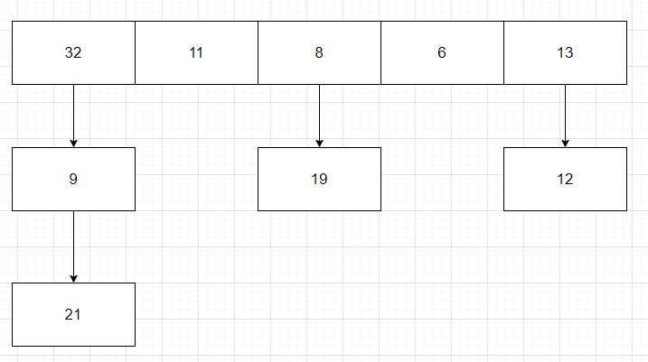
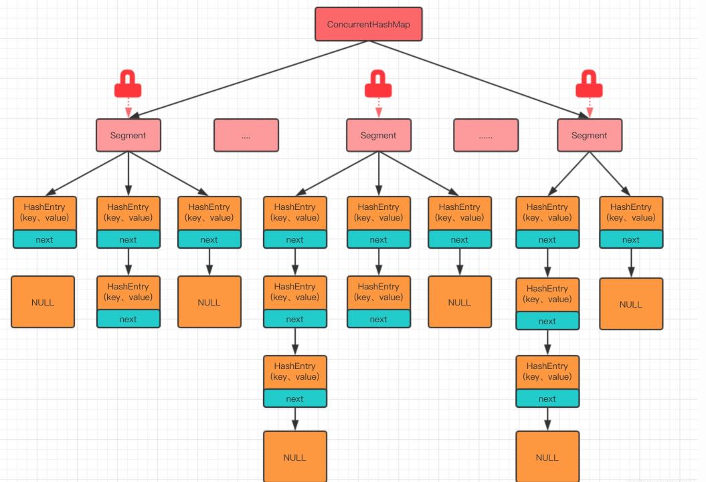
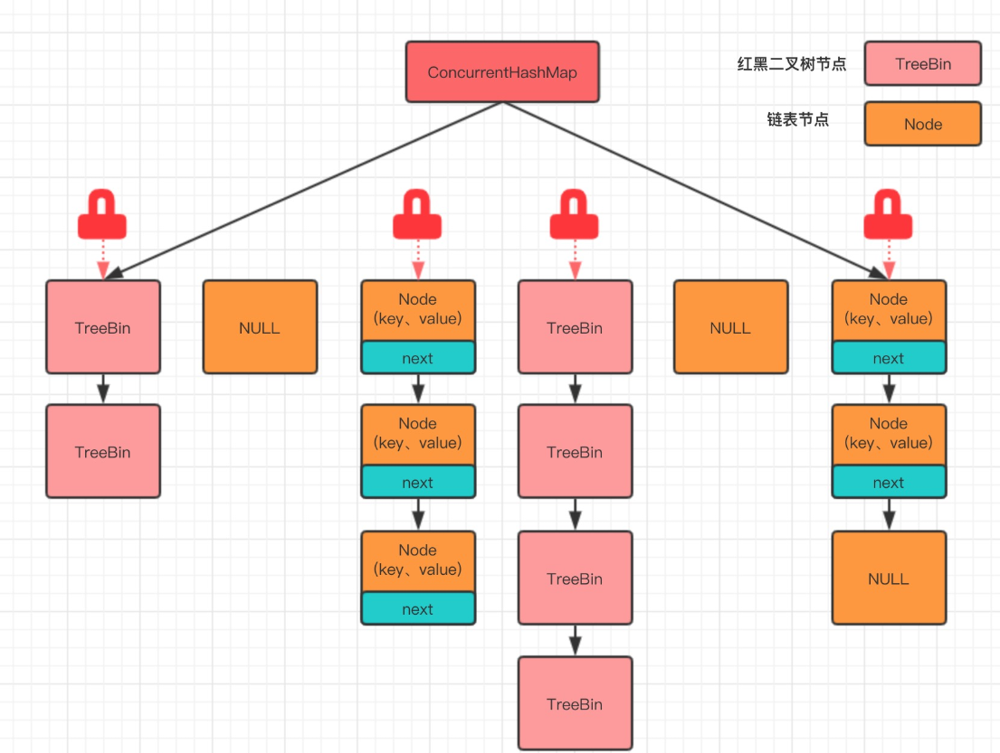

### Java八股文笔记（二）

[TOC]

#### 一、hashMap原理

##### 结构

​		hashMap是由数组+链表组成的。



​		如上图可知，这是一个==Entry==节点数组，其中，==Entry==的源码为

```java
static class Node<K,V> implements Map.Entry<K,V> {
        final int hash;
        final K key;
        V value;
        Node<K,V> next;
   
    .......
}
```

​		这是我们知道其内部有链表的结构，接着，在观察其==put==方法

```java
public V put(K key, V value) {
    return putVal(hash(key), key, value, false, true);
}

final V putVal(int hash, K key, V value, boolean onlyIfAbsent, boolean evict) {
    Node<K,V>[] tab; Node<K,V> p; int n, i;
    if ((tab = table) == null || (n = tab.length) == 0)
        n = (tab = resize()).length;
    if ((p = tab[i = (n - 1) & hash]) == null)
        tab[i] = newNode(hash, key, value, null);
    else {
        Node<K,V> e; K k;
        if (p.hash == hash &&
            ((k = p.key) == key || (key != null && key.equals(k))))
            e = p;
        else if (p instanceof TreeNode)
            e = ((TreeNode<K,V>)p).putTreeVal(this, tab, hash, key, value);
        else {
            for (int binCount = 0; ; ++binCount) {
                if ((e = p.next) == null) {
                    p.next = newNode(hash, key, value, null);
                    if (binCount >= TREEIFY_THRESHOLD - 1) // -1 for 1st
                        treeifyBin(tab, hash);
                    break;
                }
                if (e.hash == hash &&
                    ((k = e.key) == key || (key != null && key.equals(k))))
                    break;
                p = e;
            }
        }
        if (e != null) { // existing mapping for key
            V oldValue = e.value;
            if (!onlyIfAbsent || oldValue == null)
                e.value = value;
            afterNodeAccess(e);
            return oldValue;
        }
    }
    ++modCount;
    if (++size > threshold)
        resize();
    afterNodeInsertion(evict);
    return null;
}
```

​		观察第六行可以发现，==tab==数组是一个节点数组，在第七行的if中将老的==table==赋值给新生成的==tab==。而第九行的if中，==i = (n - 1) & hash==这个操作就是确定指针i处于第几个位置。而==(n - 1) & hash==等同于==hahs%n==。if判断正确则当前指针指向地方无节点，直接插入即可。反之进入else在链表中插入。

​		通过观察源码，我们可以证实hashMap的结构的为数组加链表。

##### put方法

​		put源码：

```java
public V put(K key, V value) {
    return putVal(hash(key), key, value, false, true);
}

final V putVal(int hash, K key, V value, boolean onlyIfAbsent, boolean evict) {
    Node<K,V>[] tab; Node<K,V> p; int n, i;
    /**
    * 将table赋值给新声明的tab，tab.length赋值给n。
    * 若一者为true，那么table是一个空数组，这是调用resize方法，生成一个新的长度为16的node节点数组
    */
    if ((tab = table) == null || (n = tab.length) == 0)
        n = (tab = resize()).length;
    /**
    * (n - 1) & hash等同于hash%n(二进制运算比取模快)，确定i的值。
    * 判断为true那么数组位置i上无节点，直接new一个就行
    */
    if ((p = tab[i = (n - 1) & hash]) == null)
        tab[i] = newNode(hash, key, value, null);
    else {
        Node<K,V> e; K k;
        /**
        * 更新操作，存在key，那么将p赋值给e，随后更新e的value
        */
        if (p.hash == hash &&
            ((k = p.key) == key || (key != null && key.equals(k))))
            e = p;
        /**
        * 数组后连接的是红黑树的情况下，将节点插入红黑树
        */
        else if (p instanceof TreeNode)
            e = ((TreeNode<K,V>)p).putTreeVal(this, tab, hash, key, value);
        else {
            /**
            * 链表插入操作。
            */
            for (int binCount = 0; ; ++binCount) {
                if ((e = p.next) == null) {
                    p.next = newNode(hash, key, value, null);
                    if (binCount >= TREEIFY_THRESHOLD - 1) // -1 for 1st
                        treeifyBin(tab, hash);
                    break;
                }
                if (e.hash == hash &&
                    ((k = e.key) == key || (key != null && key.equals(k))))
                    break;
                p = e;
            }
        }
        if (e != null) { // existing mapping for key
            V oldValue = e.value;
            if (!onlyIfAbsent || oldValue == null)
                e.value = value;
            afterNodeAccess(e);
            return oldValue;
        }
    }
    ++modCount;
    if (++size > threshold)
        resize();
    afterNodeInsertion(evict);
    return null;
}

final Node<K,V>[] resize() {
    Node<K,V>[] oldTab = table;
    int oldCap = (oldTab == null) ? 0 : oldTab.length;
    int oldThr = threshold;
    int newCap, newThr = 0;
    if (oldCap > 0) {
        if (oldCap >= MAXIMUM_CAPACITY) {
            threshold = Integer.MAX_VALUE;
            return oldTab;
        }
        else if ((newCap = oldCap << 1) < MAXIMUM_CAPACITY &&
                 oldCap >= DEFAULT_INITIAL_CAPACITY)
            newThr = oldThr << 1; // double threshold
    }
    else if (oldThr > 0) // initial capacity was placed in threshold
        newCap = oldThr;
    else {               // zero initial threshold signifies using defaults
        newCap = DEFAULT_INITIAL_CAPACITY;
        newThr = (int)(DEFAULT_LOAD_FACTOR * DEFAULT_INITIAL_CAPACITY);
    }
    if (newThr == 0) {
        float ft = (float)newCap * loadFactor;
        newThr = (newCap < MAXIMUM_CAPACITY && ft < (float)MAXIMUM_CAPACITY ?
                  (int)ft : Integer.MAX_VALUE);
    }
    threshold = newThr;
    @SuppressWarnings({"rawtypes","unchecked"})
    Node<K,V>[] newTab = (Node<K,V>[])new Node[newCap];
    table = newTab;
    if (oldTab != null) {
        for (int j = 0; j < oldCap; ++j) {
            Node<K,V> e;
            if ((e = oldTab[j]) != null) {
                oldTab[j] = null;
                if (e.next == null)
                    newTab[e.hash & (newCap - 1)] = e;
                else if (e instanceof TreeNode)
                    ((TreeNode<K,V>)e).split(this, newTab, j, oldCap);
                else { // preserve order
                    Node<K,V> loHead = null, loTail = null;
                    Node<K,V> hiHead = null, hiTail = null;
                    Node<K,V> next;
                    do {
                        next = e.next;
                        if ((e.hash & oldCap) == 0) {
                            if (loTail == null)
                                loHead = e;
                            else
                                loTail.next = e;
                            loTail = e;
                        }
                        else {
                            if (hiTail == null)
                                hiHead = e;
                            else
                                hiTail.next = e;
                            hiTail = e;
                        }
                    } while ((e = next) != null);
                    if (loTail != null) {
                        loTail.next = null;
                        newTab[j] = loHead;
                    }
                    if (hiTail != null) {
                        hiTail.next = null;
                        newTab[j + oldCap] = hiHead;
                    }
                }
            }
        }
    }
    return newTab;
}

Node<K,V> newNode(int hash, K key, V value, Node<K,V> next) {
    return new Node<>(hash, key, value, next);
}
```

​		通过观察其源码，我们可以知道其如何插入的原理。知道其如何确定数组位置，如何插入节点，以及存在相同key时的更新操作。

#### 二、HashMap线程安全

​		HashMap不是线程安全的，但在java5之后，有了一个线程安全的HashMap——ConcurrentHashMap。若是应用在多线程环境下，那么可以使用HashTable。

- HashTable 是线程安全的。HashTable 容器使用 synchronized 来保证线程安全，但在线程竞争激烈的情况下 HashTable 的效率非常低下.

- 使用ConcurrentHashMap ，分段锁的思想，将 HashMap 进行切割，把 HashMap 中的哈希数组切分成小数组，每个小数组有 n 个 HashEntry 组成，其中小数组继承自ReentrantLock（可重入锁），这个小数组名叫Segment（JDK1.7）

  

  JDK1.8中取消了Segment 分段锁，采用 CAS + synchronized 来保证并发安全，ConcurrentHashMap 中 synchronized 只锁定当前链表或红黑二叉树的首节点，只要节点hash不冲突，就不会产生并发。

  

- 使用Collections.synchronizedMap方法，对方法进行加同步锁；

#### 三、优先队列的是实现原理

​		普通的队列是先进先出的数据结构，而优先队列为元素赋予优先级，具有最高优先级的元素成为队列首部。

优先队列一般基于二叉堆实现。

##### 二叉堆的基本原理

###### 什么是二叉堆

- 完全二叉树
- 堆的根节点的优先级最大（即最大或最小）
- 父节点的优先级必定大于子节点，兄弟节点的优先级不确定谁大谁小

###### 堆的用途

​		取最值。

###### 堆的基本操作

- 插入

  往堆插入元素，基本思想是**从最后一个位置开始，通过上浮操作不断调整位置，直到满足父节点的优先级必定大于子节点这个条件**。

  - 上浮

    **上浮**是往二叉堆添加元素用到的操作，它其实是**不断的调整k的位置为父元素的位置**直到满足条件为止。

    ```java
    // 用数组表示堆
    Object []objs = new Object[10];
    /**
     * 上浮：
     * k表示堆的最后一个位置；
     * obj表示将要插入的元素。
     */
    private void siftUp(int k, Object obj) {
        // 1. 判断k是否为根元素的位置0，如果是则直接赋值
        while(k>0) {
            // 2. 获取父元素的位置,parent = (k-1)/2
            int parent = (k-1) >>> 1;
            // 3. 如果父元素的优先级大于等于obj，跳出循环并插入obj
            if(objs[parent] >= obj) {
                break;
            }
            // 4. 如果父元素的优先级小于obj，将父元素赋值到k的位置，更改k为父元素的位置，继续循环
            objs[k] = objs[parent];
            k = parent;
        }
        // 5. 为obj赋值
        objs[k] = obj;
    }
    /**
     * 添加元素，不考虑数组扩容的情况。
     * 假设size表示当前堆包含的元素个数（注意不一定等于上面定义的10）
     */
    public void add(Object obj) {
        if(size==0) {
            objs[0] = obj;
        } else {
            siftUp(size, obj);
            size++;
        }
    }
    ```

- 删除

  删除指定位置的元素，其基本思想是**从指定位置开始，把最后一个元素放到被删除元素的位置，通过下沉或者上浮操作，使得堆满足父元素优先级大于子元素的条件。**

  - 下沉

    **下沉**是删除时用到的操作。它是把最后一个元素放到被删除元素的位置，然后重新调整使得堆满足条件的过程。

    1. 当**被删除元素的位置**位于**最后一个元素的父元素的位置**后面时，可以直接把最后一个元素插入到被删除元素的位置；然后再进行上浮操作。

    2. 否则，需要执行下沉操作。

       ```java
       // 用数组表示堆
       Object []objs = new Object[10];
       /**
        * k被删除元素的位置；
        * obj堆的最后一个元素；
        *  假设size为当前堆包含元素的个数（不一定是上面定义的10）
        */
       private void siftDown(int k, Object obj) {
           // 1. 找到最后一个元素的父节点的位置, (最后一个元素位置-1) / 2
           int parent = (size-1-1) >>> 1;
           // 2. 判断k是否在父节点位置之后，如果在之前则需要下沉操作
           while(k <= parent) {
               // 3.获取k的左右子节点的位置
               int left = k<<<2 +1;
               int right = left+1;
               // 4.选择左右子节点中优先级最高的一个
               int best;
               if (objs[left] > objs[right]) {
                   best = left;
               } else {
                   best = right;
               }
               // 5.判断obj和best的优先级谁高。如果obj优先级高，则跳出循环直接赋值，否则继续下沉
               if (obj >= objs[best]) {
                   break;
               }
               objs[k] = objs[best];
               k = best;
           }
           // 6.赋值
           objs[k] = obj;
       }
       
       /**
        * 删除第p个元素。
        */
       public void remove(int p) {
           // 1.获取最后一个元素
           Object obj = objs[size-1];
           // 2.如果p不等于最后一个元素
           if (p != size-1) {
               // 3.把最后一个元素和p进行下沉操作
               siftDown(p, obj);
               if(objs[p] == obj) {
                   // 4. 上浮
                   siftUp(p, obj);
               }
           }
           size--;
       }
       ```

       