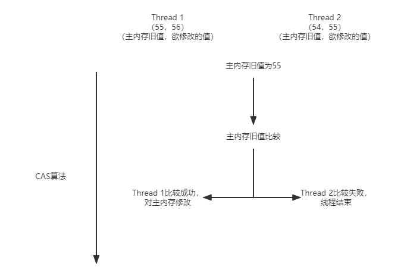

### Java八股文笔记（四）

#### 上下文切换

##### 什么是上下文切换

​		Linux是多任务操作系统，可同时执行任务远大于cpu个数的任务，但所有任务都是同时执行的吗？其实不然，只有获得了cpu时间片的任务才能执行，但他是如何“同时”运行多个任务的？

​		在每个任务执行之前，cpu需要知道任务从哪里加载，又从哪里开始运行。需要事先设置CPU寄存器和程序计数器

- CPU寄存器

  cpu内置的容量下、速度极快的内存

- 程序计数器

  用来存储cpu正在执行的指令的位置，或即将执行的下一条指令的位置

​        而这两个就是通常所说的上下文（又称cpu上下文），是cpu开始任务之前必须依赖的环境。

​		所以说，==上下文切换==就是把上一个任务的上下文保存起来，然后加载新任务的上下文至cpu寄存器和程序计数器中，最后跳转至程序计数器所指的位置，开始新的任务。

##### 进程上下文切换

​		什么时候会发生进程上下文切换呢？

- 当前进程任务执行完成，切换到下一个进程。
- 当前进程cpu时间片使用完毕，另一个进程得到cpu时间片。
- 当前进程遇到优先级更高的进程，做出让步，给优先级更高的进程cpu时间片。
- 当前进程使用的资源过大，cpu将其挂载起来，切换到另一个进程。
- 当前进程又sleep函数，进程会被挂起。

##### 线程上下文切换

​		对于操作系统来说，线程是最小的执行单元，进程是最小的资源管理单元。任务调度时，本质上是对线程的调度，而进程则是给线程提供虚拟内存，全局变量等资源。所以，对于进程和线程，我们可以这样理解。

- 当进程只有一个线程的时候，可以认为进程就是线程。
- 当一个进程有多个线程的时候，他们都会贡献父线程的资源（即共享相同的虚拟内存和全局变量等资源），这些资源在上下文切换的时候时不需要修改的。

​        然而，线程有自己的私有数据（栈和存储器），这些在上下文切换时是需要保存的。

​		所以，线程的上下文切换，有如下两种情况。

- 前后两个线程属于不同的进程，因为资源不共享，所以切换相当于进程上下文切换。
- 前后两个线程属于同一个进程，他们的虚拟内存是共享的，而线程之间拥有各自的私有数据，所以上下文切换的时候只需切换私有数据等不共享的数据即可。

##### 中断上下文切换

​		中断操作是中断任务的进行，但同时也会保存任务的参数到cpu寄存器和程序计数器中去，中断结束之后仍然可以恢复到原来的状态。

##### 小结

​		每次的上下文切换，只会消耗几十纳秒到数微秒的cpu时间，一般是察觉不到的。

​		但是，过多的上下文切换，会使得cpu将时间花费在保存寄存器与程序计数器上，从而缩短进程运行时间，降低系统的整体性能。

#### 如何减少上下文切换

​		由上可知，过多的上下文切换使得系统的整体性能下降。所以，如何减少上下文的切换呢？

​		目前，常用的方法是：==无锁并发编程==、==CAS算法==、==使用最少线程和协程==。

##### 无锁并发编程

​		将数据的ID进行Hash分段，不同段的线程处理不同段的数据。

##### CAS算法

​		Java的Atomic包使用CAS算法来更新数据，就是它在没有锁的状态下，可以保证多个线程对一个值的更新。

##### 最少线程

​		避免创建不必要的线程

##### 协程

​		在单线程里实现多任务调度，并在单线程里维持多个任务的切换。

#### CAS原理

​		简单来说，CAS算法是通过将主内存值拷贝到自己的工作内存中，当需要对主内存的值修改时，携带自己拷贝的值与主内存的值进行比较。若相等，那么可以更新该值，反之，线程需重新发起任务。

#### synchronized锁升级策略

​		升级方向：无锁 -> 偏向锁 -> 轻量级锁 -> 重量级锁

##### 偏向锁

​		当一个线程获得锁时，锁就会进入偏向状态。当这个线程再次获得锁时，同步操作就会省略，提高了时间效率。

##### 轻量级锁

​		当锁的竞争不是很激烈，多个线程争同一个锁时，未获得锁的就会自旋，等待锁的释放。当锁释放立马去争取获得锁。

##### 重量级锁

​		当锁的竞争很激烈，线程自旋的次数过多，过多的线程都去争取同一个锁时，会将未得到锁的线程挂起，等待锁得到释放后，再将这些线程唤起争取获得锁。由于借助操作系统，导致用户态内核态切换，此过程时间成本比较高。

##### 理解

> 会议室相当于对象
>
> 团队相当于线程
>
> 会议室的锁相当于对象的锁
>
> 写字板相当于MarkWord

- 偏向锁

  > 团队A需要开会讨论结果，在会议室写字板上写了团队A，当团队A再次进入时可直接进入会议室

  这就是偏向锁，经过研究发现，在大多数情况下，锁不仅不存在多线程竞争，而且总是由同一线程多次获得，因此为了减少同一线程获取锁带来的开销，所以引入`偏向锁`。

- 轻量级锁

  > 如果B团队想使用会议室，此时A还占用着会议室(写字板上记录`偏向 A团队`)，此时出现了竞争，写字板上修改为`轻量竞争`，B团队哪也不去，就在会议室外原地打转(自旋)等着，因为公司大部分会议时间都很短，B相信A一般会很快出来。
  > 如果A确实一会就出来了，B马上去抢会议室的锁。

  这就是轻量级锁，偏向锁出现了竞争会升级为`轻量级锁`，因为大部分线程占用锁的时间不会特别长，所以等待线程刚开始不需要挂起，只需要通过空转自旋等待，一般很快就会获取到锁，比过程一直占用着cpu。\

- 重量级锁

  > 上面的情况，如果B等了很久A都不出来，或者这段时间公司特别繁忙，各团队频繁开会，还有C,D,E...等等团队也要使用该会议室，这时如果A在里面开会没完没了，其它团队一直在外面傻转着也不是事。
  > 这时候就要请`会议室管理员`帮忙了，他让各团队都回去睡觉吧，写字板上修改为`重量竞争`，等A团队开完会出来，我负责通知其它团队，你们再过来抢会议室的锁。
  > 这样在会议室竞争特别激烈时，请`会议室管理员`帮忙有效的避免了等待团队傻等，但如果在竞争不激烈的情况下就没有必要请出`会议室管理员`，毕竟造成额外开销，而且靠`会议室管理员`通知再来抢会议室肯定比站会议室外面等要慢很多。

  这就是重量级锁，其中`会议室管理员`相当于操作系统，当某个线程自旋次数过多或者多个线程同时竞争锁，锁竞争变的激烈，轻量级锁升级为`重量级锁`，此时等待线程都挂起，对象锁释放后再由操作系统唤醒线程，此过程开销很大。

  `synchronized`最开始就是不管竞争激不激烈都使用重量级锁导致性能很低，但竞争激励时如果任由等待线程空转消耗跟大，所以竞争激励升级为重量级锁也是非常合理。

#### 进程通信方式

​		进程有五种通信方式：管道，FIFO，消息队列，信号量，共享内存

##### 管道

​		通常指无名管道，是 UNIX 系统 IPC 最古老的形式。

​		**特点**

- 它是半双工的（即数据只能在一个方向上流动），具有固定的读端和写端。
- 它只能用于具有亲缘关系的进程之间的通信（也是父子进程或者兄弟进程之间）。
- 它可以看成是一种特殊的文件，对于它的读写也可以使用普通的 read、write 等函数。但是它不是普通的文件，并不属于其他任何文件系统，并且只存在于内存中。

##### FIFO

​		FIFO，也称为命名管道，它是一种文件类型。

​		**特点**

- FIFO 可以在无关的进程之间交换数据，与无名管道不同。
- FIFO 有路径名与之相关联，它以一种特殊设备文件形式存在于文件系统中。

##### 消息队列

​		消息队列，是消息的链接表，存放在内核中。一个消息队列由一个标识符（即队列 ID）来标识。

​		**特点**

- 消息队列是面向记录的，其中的消息具有特定的格式以及特定的优先级。
- 消息队列独立于发送与接收进程。进程终止时，消息队列及其内容并不会被删除。
- 消息队列可以实现消息的随机查询，消息不一定要以先进先出的次序读取，也可以按消息的类型读取。

##### 信号量

​		信号量（semaphore）与已经介绍过的 IPC 结构不同，它是一个计数器。信号量用于实现进程间的互斥与同步，而不是用于存储进程间通信数据。

​		**特点**

- 信号量用于进程间同步，若要在进程间传递数据需要结合共享内存。
- 信号量基于操作系统的 PV 操作，程序对信号量的操作都是原子操作。
- 每次对信号量的 PV 操作不仅限于对信号量值加 1 或减 1，而且可以加减任意正整数。
- 支持信号量组。

##### 共享内存

​		共享内存（Shared Memory），指两个或多个进程共享一个给定的存储区。

​		**特点**

- 共享内存是最快的一种 IPC，因为进程是直接对内存进行存取。
- 因为多个进程可以同时操作，所以需要进行同步。
- 信号量 + 共享内存通常结合在一起使用，信号量用来同步对共享内存的访问。

##### 总结

1. 管道：速度慢，容量有限，只有父子进程能通讯
2. FIFO：任何进程间都能通讯，但速度慢
3. 消息队列：容量受到系统限制，且要注意第一次读的时候，要考虑上一次没有读完数据的问题
4. 信号量：不能传递复杂消息，只能用来同步
5. 共享内存区：能够很容易控制容量，速度快，但要保持同步，比如一个进程在写的时候，另一个进程要注意读写的问题，相当于线程中的线程安全，当然，共享内存区同样可以用作线程间通讯，不过没这个必要，线程间本来就已经共享了同一进程内的一块内存

#### 线程通信方式

​		线程通信主要可以分为三种方式，分别为**共享内存**、**消息传递**和**管道流**。每种方式有不同的方法来实现

- 共享内存：线程之间共享程序的公共状态，线程之间通过读-写内存中的公共状态来隐式通信。

> volatile共享内存

- 消息传递：线程之间没有公共的状态，线程之间必须通过明确的发送信息来显示的进行通信。

> wait/notify等待通知方式
> join方式

- 管道流

> 管道输入/输出流的形式

