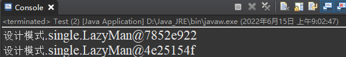
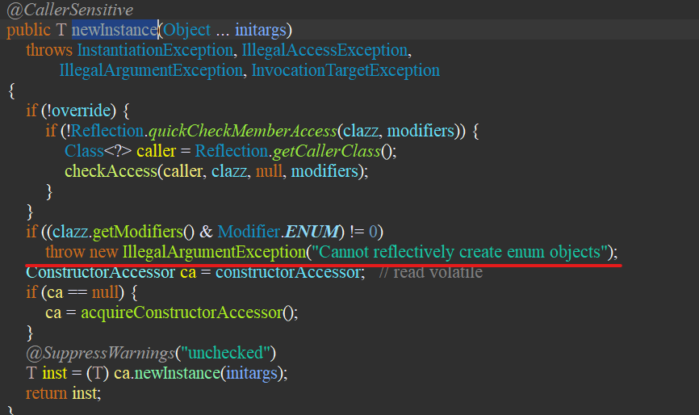
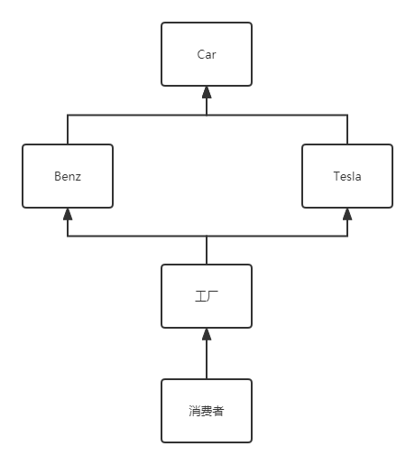
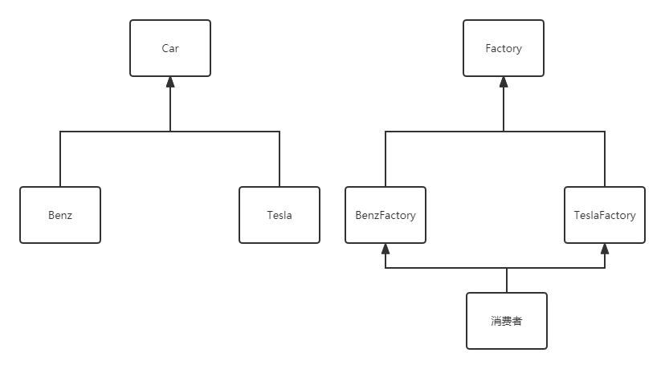
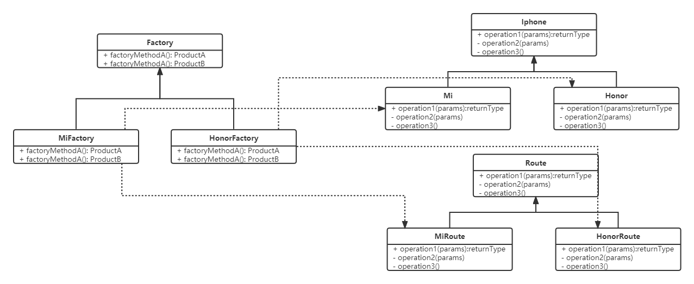
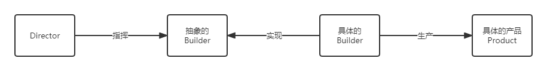
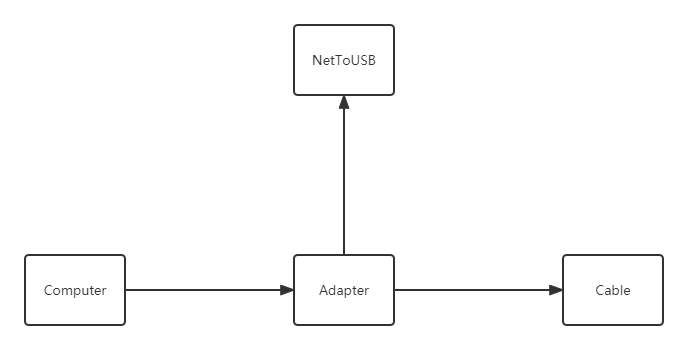
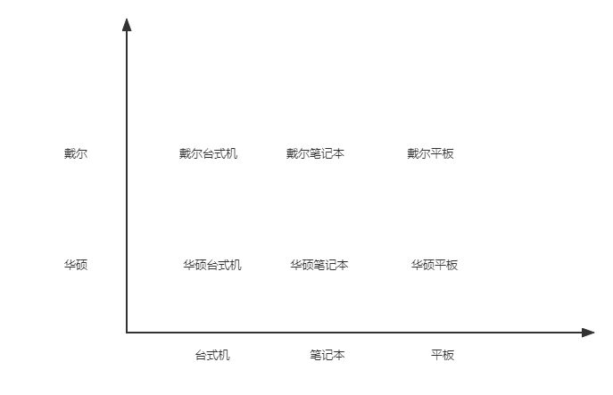

### Java八股文笔记（三）

### Java的23种设计模式

#### 单例模式

​		单例模式有以下特点：

​		1、单例类只能有一个实例。

​		2、单例类必须自己创建自己的唯一实例。

​		3、单例类必须给所有其他对象提供这一实例。

​		单例模式分为饿汉式与懒汉式。

- 饿汉式

```java
public class SingleTon{
    
    protected SingleTon singleTon;
    
    private SingleTon(){
        System.out.println("private SingleTon");
    }
    
    public static SingleTon getInstance(){
        if(singleTon == null){
            singleTon = new SingleTon();
        }
        return singleTon;
    }
}
```

- 懒汉式

```java
public class SingleTon{
    protected SingleTon singleTon;
    
    private SingleTon(){
        System.out.println("private SingleTon()");
    }
    
    public static SingleTon getInstance(){
        //双重检验机制
        if(singleTon == null){
            synchronized(SingleTon.class){
                if(singleTOn == null){
                    singleTon = new SingleTon();
                }
            }
        }
        return singleTon;
    }
}
```

​		**单例模式真的是安全的吗？**

​		我们学习过反射的知识，可以通过反射得到一个类的构造器，接着设置断言，将私有设置为公有，那么就可以通过newInstance得到一个新的对象。

```java
public class Test{
    public static void main(String[] args){
        //正常获取单例对象
        SingleTon singleTon = SingleTon.getInstance();
        
        //通过反射new一个对象
        SingleTon reflactSingleTon = null;
        try{
            Constructor<SingleTon> constructor = SingleTon.class.getDeclaredConstructor();
            constructor.setAccessible(true);
            reflactSingleTon = constructor.newInstance();
        }catch(NoSuchMethodException | SecurityException e){
            e.printStackTrace();
        } catch (InstantiationException e) {
			e.printStackTrace();
		} catch (IllegalAccessException e) {
			e.printStackTrace();
		} catch (IllegalArgumentException e) {
			e.printStackTrace();
		} catch (InvocationTargetException e) {
			e.printStackTrace();
		}
        
        System.out.println(singleTon);
        System.out.println(reflactSingleTon);
        
    }
}
```

​		执行结果为：



​		可以看到，我们得到了两个不同的对象，单例对象被破坏了。那么我们如何保证其不被破坏呢？

​		而反射最后一步的操作中，newInstance是创建对象的关键，这时我们查看这个方法的源码，他抛出了这么一个异常



​		“Cannot reflectively crete enum objects”，无法通过反射创建一个枚举类。、

​		枚举类才是真正的单例类。

#### 工厂模式

​		获取对象时，直接从工厂中获取对象，无需知道创建对象时需要的参数。

​		工厂模式分类三类（简单工厂，方法工厂，抽象工厂）。

1. 简单工厂模式

   ​	用来生产同一等级结构中的任意产品。

2. 方法工厂模式

   ​	用来生产同一等级结构中的固定产品

3. 抽象工厂模式

   ​	围绕一个超级工厂创建其他工厂。该超级工厂又称为其他工厂的工厂

##### 简单工厂模式

​		例



​		可以看到当消费者购买汽车时，只需到工厂提货即可，无需自己再造一遍车。

​		**Car**

```java
public interface Car{
    public void name();
}
```

​		**Benz**

```java
public class Benz implements Car{
    @Override
    public void name(){
        System.out.println("Benz car");
    }
}
```

​		**Tesla**

```java
public class Tesla implements Car{
    @Override
    public void name(){
        System.out.println("Tesla car");
    }
}
```

​		**Factory**

```java
public class CarFactory{
    
    public static Car getCar(String name){
        if("Benz".equals(name)){
            return new Benz();
        }else if("Tesla".equals(name)){
            return new Tesla();
        }
    }
}
```

​		**Consumer**

```java
public class Comsumer{
    public static void main(String[] args){
        Car Benz = CarFactory.getCar("Benz");
        Car Tesla = CarFactory.getCar("Tesla");
    }
}
```

​		但是这种模式的弊端也尤为明显，当工厂新增生产线，生产新型号汽车时，则需要修改工厂的源代码，这是不利于扩展，维护的。此时，方法工厂模式应运而生。

##### 方法工厂模式

​		例



​		这时，消费者购买心仪的汽车只需去到相应的工厂即可。

​		**Car**

```java
public interface Car{
    public void name();
}
```

​		**Benz**

```java
public class Benz implements Car{
    @Override
    public void name(){
        System.out.println("Benz car");
    }
}
```

​		**Tesla**

```java
public class Tesla implements Car{
    @Override
    public void name(){
        System.out.println("Tesla car");
    }
}
```

​		**Factory**

```java
public interface Factory{
    public Car getCar();
}
```

​		**BenzFactory**

```java
public class BenzFactory implements Factory{
    @Override
    public Car getCar(){
        return new Benz();
    }
}
```

​		**TeslaFactory**

```java
public class TeslaFactory implements Factory{
    @Override
    public Car getCar(){
        return new Tesla();
    }
}
```

​		**Consumer**

```java
public class Comsumer{
    public static void main(String[] args){
        Car Benz = BenzFactory.getCar("Benz");
        Car Tesla = TeslaFactory.getCar("Tesla");
    }
}
```

​		各个工厂各司其职，专心生产自己的东西，精益求精，努力追求匠人精神！

##### 抽象工厂模式

​		例



​		**Iphone**

```java
public interface Iphone{
    public void start();
    public void end();
}
```

​		**Mi**

```java
public class Mi implements Iphone{
    @Override
    public void start(){
        System.out.println("Mi iphone start.")
    }
    @Override
    public void end(){
        System.out.println("Mi iphone end.")
    }
}
```

​		**Honor**

```java
public class Honor implements Iphone{
    @Override
    public void start(){
        System.out.println("Honor iphone start.")
    }
    @Override
    public void end(){
        System.out.println("Honor iphone end.")
    }
}
```

​		**Route**

```java
public interface Route{
    public void connect();
    public void disConnect();
}
```

​		**MiRoute**

```java
public class MiRoute implements MiRoute{
    @Override
    publci void connect(){
        System.out.println("MiRoute was connected");
    }
    @Override
    publci void disconnect(){
        System.out.println("MiRoute is disconnect");
    }
}
```

​		**HonorRoute**

```java
public class HonorRoute implements MiRoute{
    @Override
    publci void connect(){
        System.out.println("HonorRoute was connected");
    }
    @Override
    publci void disconnect(){
        System.out.println("HonorRoute is disconnect");
    }
}
```

​		**Factory**

```java
public interface Factory{
    public Iphone getIphone();
    public Route getRoute();
}
```

​		**MiFactory**

```java
public class MiFactory implements Factory{
    @Override
    public Iphone getIphone(){
        return new Mi();
    }
    
    @Override
    public Route getRoute(){
        return new MiRoute();
    }
}
```

​		**HonorFactory**

```java
public class HonorFactory implements Factory{
    @Override
    public Iphone getIphone(){
        return new Honor();
    }
    
    @Override
    public Route getRoute(){
        return new HonorRoute();
    }
}
```

​		这种模式适合固定的生产线，不添加新的生产线。

#### 建造者模式

​		当多个方法互不干扰，相互独立的时候，可以包装到一个类中，之后进行组合。


​		例如点餐。可以自由搭配自己喜欢的菜品

​		**Product**

```java
public class Product{
    public String foodA;
    public String foodB;
    public String foodC;
    public String foodD;
    
    public Product(){
        
    }
    
    public void setFoodA(String food){
        foodA = food;
    }
    public String getFoodA(){
        return foodA;
    }
    
    public void setFoodB(String food){
        foodB = food;
    }
    public String getFoodB(){
        return foodB;
    }
    
    public void setFoodC(String food){
        foodC = food;
    }
    public String getFoodC(){
        return foodC;
    }
    
    public void setFoodD(String food){
        foodD = food;
    }
    public String getFoodD(){
        return foodD;
    }
}
```

​		**Builder(抽象的Builder)**

```java
public interface Builder{
    /**
    * 返回值时原来的对象，可以使用链式编程。
    */
    public Product setFoodA(String food);
    public Product setFoodB(String food);
    public Product setFoodC(String food);
    public Product setFoodD(String food);
    
    public Product getProduct();
}
```

​		**Chef(具体的Builder)**

```java
public class Chef implements Builder{
    private Product product;
    
    public Chef(){
        product = new Product();
    }
    
    @Override
    public Product setFoodA(String food){
        product.setFoodA(food);
        return product;
    }
    @Override
    public Product setFoodB(String food){
        product.setFoodB(food);
        return product;
    }
    @Override
    public Product setFoodC(String food){
        product.setFoodC(food);
        return product;
    }
    @Override
    public Product setFoodD(String food){
        product.setFoodD(food);
        return product;
    }
    
    @Override
    public Product getProduct(){
        return Product();
    }
}
```

​		**Director**

```java
public class Director{
    
    public Product build(Builder builder){
        builder.setFoodA("米饭");
        builder.setFoodA("肉末茄子");
        builder.setFoodA("地三鲜");
        builder.setFoodA("红烧肉");
        return builder.getProduct();
    }
}
```

​		**Comsuer**

```java
public class Test{
    public static vodi main(String[] args){
        Builder chef = new Chef();
        Product order = new Director(chef).build();
    }
}
```

#### 适配器模式

​		

​		**Cable**

```java
public class Cable{
    publci void request(){
        System.out.println("http request...");
    }
}
```

​		**NetToUSB**

```java
public interface NetToUSB{
    public void heandlerRequest();
}
```


​		**Adapter**

```java
public class Adapter implements NetToUSB{
    private Cable cable;
    
    public Adapter(){
        cable = new Cable();
    }
    
    public Adapter(Cable cable){
        this.cable = cable;
    }
    
    @Override
    public void heandlerRequest(){
        cable.request();
    }
}
```

​		**Computer**

```java
public class Computer{
    public void net(NetToUSB netToUSB){
        netToUSB.handlerRequest();
    }
}
```

​		**Test**

```java
public class Test{
    public static void main(String[] args){
        Cable cable = new Cable();
        Adapter adapter = new Adapter(cable);
        Computer.net(adapter);
    }
}
```

#### 桥接模式

​		华硕台式机，华硕笔记本，华硕平板，戴尔台式机，戴尔笔记本，戴尔平板...我们真的是创建六个类吗？

​		使用排列组合之后发现只需创建五个类（华硕，戴尔，台式机，笔记本，平板）。



​		**Brand**

```java
public interface Brand{
    public void info();
}
```

​		**ASUS**

```java
public class ASUS implements Brand{
    @Override
    public void info(){
        System.out.print("华硕");
    }
}
```

​		**Dell**

```java
public class Dell implements Brand{
    @Override
    public void info(){
        System.out.print("戴尔");
    }
}
```

​		**Station**

```java
public interface Station{
    public void info();
}
```

​		**DeskTop**

```java
public class DeskTop implements Station{
    private Brand brand;
    
    public DeskTop(Brand brand){
        this.brand = brand;
    }
    
    @Override
    public void info(){
        super.info();
        System.out.println("台式机");
    }
}
```

​		**LapTop**

```java
public class LapTop implements Station{
    private Brand brand;
    
    public LapTop(Brand brand){
        this.brand = brand;
    }
    
    @Override
    public void info(){
        super.info();
        System.out.println("笔记本");
    }
}
```

​		**TabletTop**

```java
public class TabletTop implements Station{
    private Brand brand;
    
    public TabletTop(Brand brand){
        this.brand = brand;
    }
    
    @Override
    public void info(){
        super.info();
        System.out.println("平板");
    }
}
```

​		**Test**

```java
public class Test{
    public static void main(String[] args){
        Brand ASUS = new ASUS();
        Brand Dell = new Dell();
        Station asusDeskTop = new DeskTop(ASUS);
        Station asusLapTop = new LapTop(ASUS);
        Station asusTabletTop = new TabletTop(ASUS);
        
        Station dellDeskTop = new DeskTop(Dell);
        Station dellLapTop = new LapTop(Dell);
        Station dellTabletTop = new TabletTop(Dell);
    }
}
```


#### 静态代理


#### 动态代理


